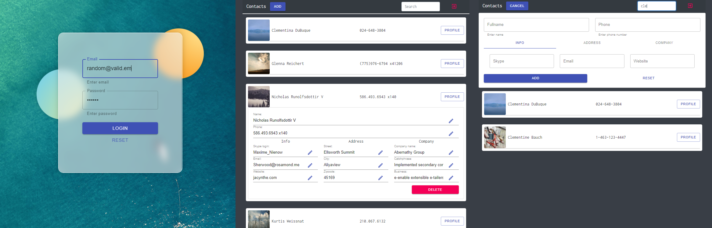

# Cute login form and contact list

## :pushpin: About

Quite simple login form with usable contact list

## :pushpin: ScreenShot

## :pushpin: Demo

Try it [here](https://foxcaulfield.github.io/cute-login-form-and-contacts/)

## :pushpin: Technologies, libraries & services

Built with:

- React
- JSONPlaceholder
- axios
- material-ui
- bootstrap
- formik
- gh-pages

## :pushpin: How to use

- Enter random valid email and password to login
- Add contact by tapping "Add" button in the navbar and enter values to form
- You can also add contact information when first creating a contact or by opening an existing contact and tapping "Profile"
- Edit the contact information as desired, when you're finished, tap "Save"
- Tap "Delete" then confirm your action to delete contact
- You can quickly search all of your contacts by using the Search bar at the top of the contacts list, just tap the Search bar and type - any contacts matching your search will appear
